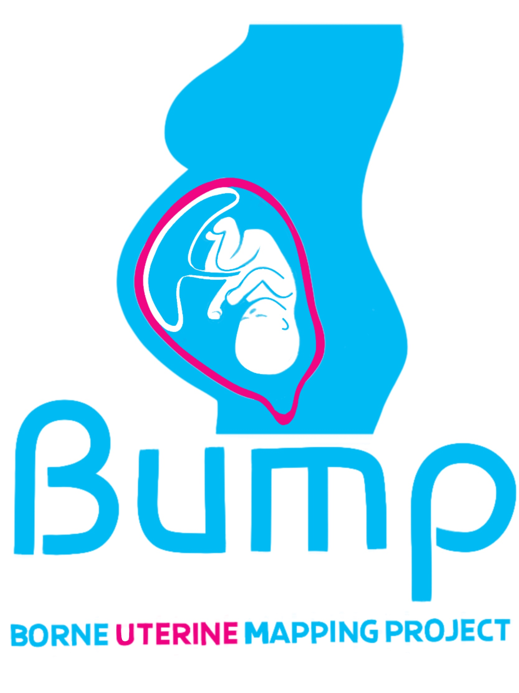

# Data analysis for the BUMP Feasibility Study

Code for the transcriptomic data analysis for the [BUMP](https://bumpcollaborative.org/) (Borne Uterine Mapping Project) feasibility study. 

This is a study funded by [Borne](https://www.borne.org.uk/) that seeks to confirm the feasibility of a systematic study of the biological interactions across different cells and tissues in the human uterus; and the outline of opportunities to test and expand on novel discoveries that can help prevent the onset of preterm labour.

